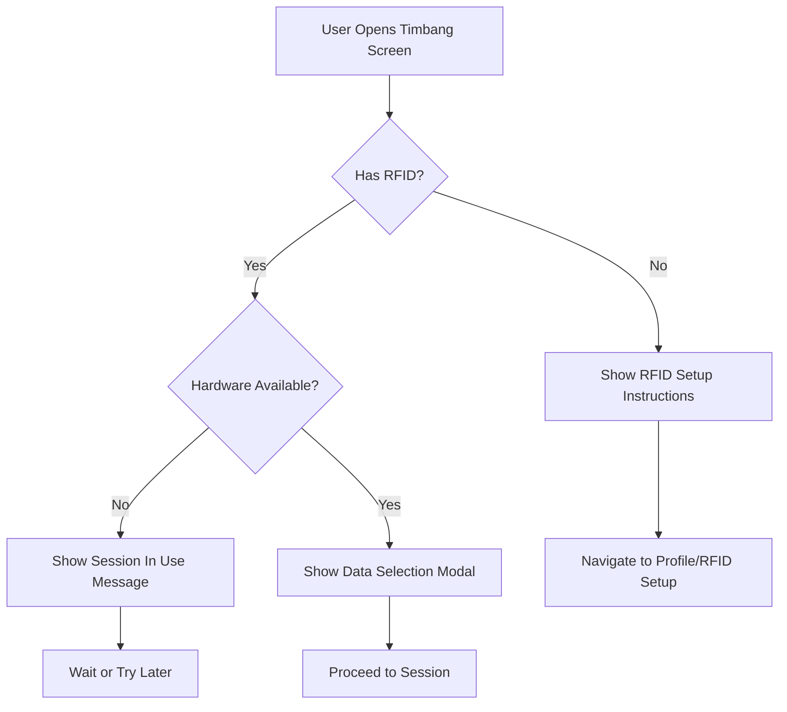
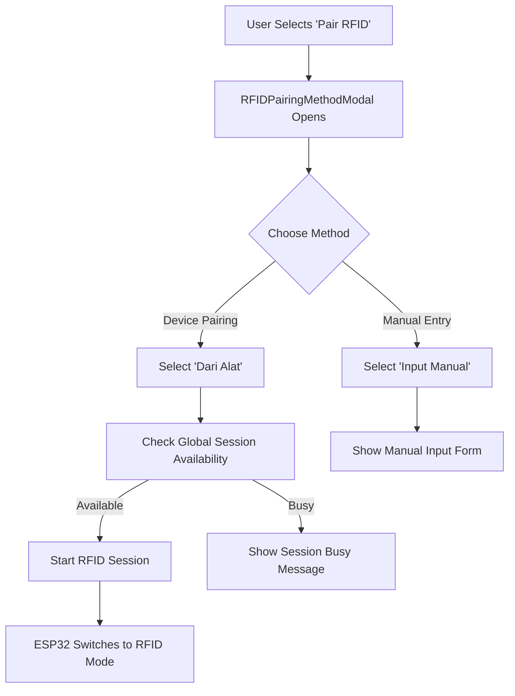

# Data Collection Flow & RFID Pairing - Child Nutrition Monitoring System

## Overview

This document describes the complete data collection workflow and RFID pairing process in the Intan child nutrition monitoring system, covering both measurement data collection and RFID card pairing from user interaction to data storage and analysis.

## System Architecture

### Hybrid Firebase Architecture (Firestore + Realtime Database)

```
┌─────────────────┐    ┌─────────────────┐    ┌─────────────────┐
│   Mobile App    │    │    Firebase     │    │   ESP32 IoT     │
│                 │    │                 │    │                 │
│  Firestore ◄────┼────┤ Firestore:      │    │                 │
│  (User Data)    │    │ • User profiles │    │                 │
│  (History)      │    │ • History data  │    │                 │
│                 │    │ • Admin data    │    │                 │
│                 │    │                 │    │                 │
│  RTDB ◄─────────┼────┤ Realtime DB:    ├────┤► RTDB ◄────────┤
│  (Live State)   │    │ • Session state │    │  (Simple Values)│
│  (Real-time)    │    │ • Measurements  │    │  (Event-driven) │
│                 │    │ • Hardware sync │    │                 │
└─────────────────┘    └─────────────────┘    └─────────────────┘
         │                       │                       │
    ┌────▼────┐             ┌────▼────┐             ┌────▼────┐
    │ Profile │             │ Session │             │ Sensors │
    │ Forms   │             │ Coord   │             │ ML Algo │
    │ Modals  │             │ Storage │             │ Display │
    └─────────┘             └─────────┘             └─────────┘
```

### Why Hybrid Architecture?

**Current Pain Points with Firestore-only:**
- ESP32 must parse complex JSON documents
- 5-second polling creates network overhead
- Synchronous operations blocking ESP32
- Memory-intensive JSON parsing on microcontroller

**Benefits of Hybrid Approach:**
- **Firestore**: Complex documents, user profiles, historical data, queries
- **Realtime Database**: Simple key-value, real-time sync, ESP32-friendly
- **Optimized Performance**: Right tool for right job
- **Simplified ESP32 Code**: Direct value access instead of JSON parsing

# Part 1: Data Collection Flow

## 1. Data Types Collected

### User Profile Data
- **Child Information**
  - Name (string)
  - Birth date (Date) → Auto-calculates age in years/months
  - Gender (male/female)
  - RFID card assignment
- **Parent Information**
  - Parent name (string)
  - Email (for authentication)
- **Storage Location**: `/users/{userId}` collection
- **Auto-updates**: Age recalculated on each profile access

### Measurement Data
- **Physical Measurements**
  - Weight (kg) - from HX711 load cell sensor
  - Height (cm) - from HC-SR04 ultrasonic sensor
  - BMI (calculated) - weight / (height/100)²
- **Assessment Data**
  - Nutrition status (AI-determined using K-NN algorithm)
  - Eating pattern (user-selected: kurang/cukup/berlebih)
  - Child response level (user-selected: pasif/sedang/aktif)
- **Metadata**
  - Timestamp (measurement date/time)
  - User demographics (age, gender at time of measurement)
- **Storage Location**: `/users/{userId}/data/{measurementId}` subcollection

## 2. Complete Weighing Session Workflow

### Phase 1: Pre-Session Validation



**Key Validations:**
- RFID card must be paired with user account
- Hardware must not be in use by another user
- User authentication must be valid

### Phase 2: Data Selection & Session Creation

```javascript
// DataSelectionModal User Inputs
const selectionData = {
  eatingPattern: 'kurang' | 'cukup' | 'berlebih',
  childResponse: 'pasif' | 'sedang' | 'aktif'
};

// Session Creation in globalSessionService.js
await startWeighingSession(userId, selectionData);
```

**Process:**
1. User selects eating pattern and child response via DataSelectionModal
2. App calls `startWeighingSession()` with user parameters
3. Global session document created in Firebase with:
   - Session type: "weighing"
   - User data (ID, name, RFID, age, gender)
   - Selection data (eating pattern, child response)
   - Measurement placeholders (weight: 0, height: 0)

### Phase 3: Hardware Coordination & Measurement

```cpp
// ESP32 Firmware Flow (WiFi.ino)
processGlobalSession() {
  // 1. Monitor Firebase every 5 seconds
  // 2. Detect session type "weighing"
  // 3. Load user data and session parameters
  // 4. Wait for matching RFID tap
  // 5. Begin sensor measurements
  // 6. Run K-NN nutrition classification
  // 7. Upload results to Firebase
}
```

**Hardware Process:**
1. **Session Detection**: ESP32 monitors Firebase for active sessions
2. **RFID Validation**: Hardware waits for matching RFID card tap
3. **Sensor Reading**: 
   - Load cell measures weight (filtered and averaged)
   - Ultrasonic sensor measures height (distance from ceiling)
4. **ML Processing**: K-NN algorithm determines nutrition status
5. **Data Upload**: Two-phase upload to Firebase:
   - Phase 1: Measurement values
   - Phase 2: Completion flag

### Phase 4: Result Processing & Storage

```javascript
// App-side completion detection (timbang.jsx)
useEffect(() => {
  const unsubscribe = subscribeToSystemStatus((status) => {
    if (status.measurementComplete && status.weight > 0) {
      handleWeighingCompleted(status);
    }
  });
  return unsubscribe;
}, []);
```

**Completion Flow:**
1. **Real-time Detection**: App listens for `measurementComplete: true`
2. **Data Validation**: Checks weight > 0 and height > 0
3. **Storage Operations**:
   - `addMeasurement()`: Saves to user's data collection
   - `updateUserProfile()`: Updates latest weighing cache
4. **UI Update**: Shows WeighingResultModal with comprehensive results
5. **Session Cleanup**: `endGlobalSession()` resets all session fields

## 3. Hybrid Firebase Data Structure

### Firestore (Complex Documents)
```javascript
// User profiles & authentication
users/{userId} = {
  name: "John Doe",
  parentName: "Jane Doe", 
  birthdate: "2018-01-01",
  gender: "male",
  email: "parent@example.com",
  ageYears: 6,          // Auto-calculated
  ageMonths: 3,         // Auto-calculated
  rfid: "A1B2C3D4",     // Hex identifier
  rfidNumber: "001",    // Human-readable
  role: "user",         // user | admin
  
  // Latest measurement cache
  latestWeighing: {
    weight: 25.5,
    height: 120.3,
    imt: 16.8,
    nutritionStatus: "gizi baik",
    dateTime: "2024-01-01T10:00:00Z"
  }
}

// Historical measurement data
users/{userId}/data/{measurementId} = {
  weight: 25.5,
  height: 120.3,
  imt: 16.8,
  nutritionStatus: "gizi baik",
  eatingPattern: "cukup",
  childResponse: "aktif",
  ageYears: 6,
  ageMonths: 3,
  gender: "male",
  dateTime: "2024-01-01T10:00:00Z",
  createdAt: "2024-01-01T10:00:00Z"
}
```

### Realtime Database (Simple Key-Value)
```javascript
{
  "hardware": {
    // Session coordination (replaces systemStatus/hardware)
    "session": {
      "active": true,
      "type": "weighing",        // weighing | rfid | idle
      "userId": "abc123",
      "userName": "John Doe",
      "userRfid": "A1B2C3D4",
      "startTime": 1640995200,
      "lastActivity": 1640995200,
      
      // Session parameters
      "eatingPattern": "cukup",
      "childResponse": "aktif",
      "ageYears": 6,
      "ageMonths": 3,
      "gender": "male"
    },
    
    // Real-time measurements (ESP32 writes here)
    "measurements": {
      "weight": 25.5,
      "height": 120.3,
      "imt": 16.8,
      "nutritionStatus": "gizi baik",
      "complete": false,
      "timestamp": 1640995200
    },
    
    // Hardware status
    "status": {
      "online": true,
      "error": null,
      "lastHeartbeat": 1640995200,
      "version": "1.0.0"
    },
    
    // RFID detection events
    "rfid": {
      "detected": "A1B2C3D4",
      "timestamp": 1640995200,
      "valid": true
    }
  }
}
```

### Data Distribution Logic

**Firestore (Document-based) for:**
- User profiles with complex nested data
- Historical measurement records with queries
- Admin operations and user management
- Data that needs complex filtering/sorting
- Authentication and role-based data

**Realtime Database (Key-Value) for:**
- Hardware session coordination
- Real-time sensor measurements
- Live system status and health monitoring
- Simple state flags and timestamps
- ESP32-friendly simple data types

## ESP32 Code Simplification with RTDB

### Before: Complex Firestore Operations
```cpp
// Current complex JSON parsing and document handling
String response = firestoreClient.getDocument("systemStatus/hardware", "", true);
JsonDocument doc;
deserializeJson(doc, response);

// Extract nested fields with complex parsing
bool isInUse = doc["fields"]["isInUse"]["booleanValue"];
String sessionType = doc["fields"]["sessionType"]["stringValue"];
String currentUserId = doc["fields"]["currentUserId"]["stringValue"];
float weight = doc["fields"]["weight"]["doubleValue"];
// ... 20+ lines of JSON field extraction

// Complex document updates
JsonDocument measurementDoc;
JsonObject fields = measurementDoc.createNestedObject("fields");
JsonObject weightField = fields.createNestedObject("weight");
weightField["doubleValue"] = roundedWeight;
JsonObject heightField = fields.createNestedObject("height");
heightField["doubleValue"] = roundedHeight;
// ... many more nested objects
```

### After: Simple RTDB Operations
```cpp
// Direct value access - much simpler!
bool sessionActive = Firebase.getBool(firebaseData, "hardware/session/active");
String sessionType = Firebase.getString(firebaseData, "hardware/session/type");
String userId = Firebase.getString(firebaseData, "hardware/session/userId");
String userRfid = Firebase.getString(firebaseData, "hardware/session/userRfid");

// Direct value updates
Firebase.setFloat(firebaseData, "hardware/measurements/weight", 25.5);
Firebase.setFloat(firebaseData, "hardware/measurements/height", 120.3);
Firebase.setString(firebaseData, "hardware/measurements/nutritionStatus", "gizi baik");
Firebase.setBool(firebaseData, "hardware/measurements/complete", true);

// System status updates
Firebase.setBool(firebaseData, "hardware/status/online", true);
Firebase.setInt(firebaseData, "hardware/status/lastHeartbeat", now());
```

### Simplified ESP32 State Management
```cpp
enum SystemState {
  IDLE,
  WEIGHING_SESSION, 
  RFID_PAIRING,
  ERROR_STATE
};

SystemState currentState = IDLE;

void updateSystemState() {
  // Check session type from RTDB
  String sessionType = Firebase.getString(firebaseData, "hardware/session/type");
  bool sessionActive = Firebase.getBool(firebaseData, "hardware/session/active");
  
  if (!sessionActive) {
    currentState = IDLE;
    return;
  }
  
  if (sessionType == "weighing") {
    currentState = WEIGHING_SESSION;
    handleWeighingSession();
  } else if (sessionType == "rfid") {
    currentState = RFID_PAIRING;
    handleRFIDPairing();
  }
}

void handleWeighingSession() {
  // Get session data directly
  String expectedRfid = Firebase.getString(firebaseData, "hardware/session/userRfid");
  String userName = Firebase.getString(firebaseData, "hardware/session/userName");
  
  // Display user info
  display.println("Weighing Session");
  display.println("User: " + userName);
  display.println("Tap RFID: " + expectedRfid);
  
  // Check RFID match
  if (currentRfidTag == expectedRfid) {
    performMeasurement();
  }
}

void performMeasurement() {
  // Get sensor readings
  float weight = getWeightReading();
  float height = getHeightReading();
  float bmi = calculateBMI(weight, height);
  String nutritionStatus = classifyNutrition(weight, height, bmi);
  
  // Update measurements in RTDB
  Firebase.setFloat(firebaseData, "hardware/measurements/weight", weight);
  Firebase.setFloat(firebaseData, "hardware/measurements/height", height);
  Firebase.setFloat(firebaseData, "hardware/measurements/imt", bmi);
  Firebase.setString(firebaseData, "hardware/measurements/nutritionStatus", nutritionStatus);
  Firebase.setBool(firebaseData, "hardware/measurements/complete", true);
  
  // Update timestamp
  Firebase.setInt(firebaseData, "hardware/measurements/timestamp", now());
}
```

## 4. Hybrid Data Flow Services

### globalSessionService.js (Updated for Hybrid)
**Purpose**: Manages shared ESP32 hardware access using RTDB

**Key Functions:**
```javascript
// Session Management (now uses RTDB)
initializeRTDBSession()              // Initialize RTDB hardware structure  
startWeighingSession(userId, data)   // Create weighing session in RTDB
startRfidSession(userId)             // Create RFID pairing session in RTDB
endGlobalSession()                   // Cleanup RTDB session

// Monitoring (RTDB listeners)
subscribeToHardwareSession(callback) // Real-time RTDB session updates
subscribeToMeasurements(callback)    // Real-time measurement updates
subscribeToRFIDEvents(callback)      // Real-time RFID detection events

// Session Control
isSessionAvailable()                 // Check RTDB hardware/session/active
isMySession(userId)                  // Validate session ownership
```

### React Native RTDB Integration
```javascript
// services/rtdbService.js (new service)
import { getDatabase, ref, onValue, set, remove } from 'firebase/database';

const rtdb = getDatabase();

export const subscribeToHardwareSession = (callback) => {
  const sessionRef = ref(rtdb, 'hardware/session');
  return onValue(sessionRef, (snapshot) => {
    const data = snapshot.val();
    callback(data);
  });
};

export const startWeighingSession = async (userId, sessionData) => {
  const sessionRef = ref(rtdb, 'hardware/session');
  await set(sessionRef, {
    active: true,
    type: 'weighing',
    userId: userId,
    userName: sessionData.userName,
    userRfid: sessionData.userRfid,
    startTime: Date.now(),
    lastActivity: Date.now(),
    eatingPattern: sessionData.eatingPattern,
    childResponse: sessionData.childResponse,
    ageYears: sessionData.ageYears,
    ageMonths: sessionData.ageMonths,
    gender: sessionData.gender
  });
};

export const subscribeToMeasurements = (callback) => {
  const measureRef = ref(rtdb, 'hardware/measurements');
  return onValue(measureRef, (snapshot) => {
    const data = snapshot.val();
    if (data && data.complete) {
      callback(data);
    }
  });
};
```

### dataService.js (Enhanced for Hybrid)
**Purpose**: CRUD operations for measurement data in Firestore

**Key Functions:**
```javascript
// Measurement Operations (Firestore)
addMeasurement(userId, data)        // Store measurement in Firestore
getUserMeasurements(userId)         // Retrieve user history from Firestore
updateMeasurement(userId, id, data) // Edit measurement in Firestore
deleteMeasurement(userId, id)       // Remove measurement from Firestore

// Data Bridge Functions (RTDB → Firestore)
saveMeasurementFromRTDB(rtdbData)   // Convert RTDB measurement to Firestore
syncLatestWeighing(userId, data)    // Update user profile with latest measurement

// Utilities
generateRandomData(count)           // Testing data generation
```

**Hybrid Data Flow:**
```javascript
// Enhanced addMeasurement for hybrid architecture
export const addMeasurement = async (userId, measurementData) => {
  try {
    // 1. Add to Firestore measurement history
    const userDataRef = collection(db, `users/${userId}/data`);
    const docRef = await addDoc(userDataRef, {
      ...measurementData,
      createdAt: new Date()
    });
    
    // 2. Update user profile's latestWeighing cache
    await updateUserProfile(userId, {
      latestWeighing: {
        weight: measurementData.weight,
        height: measurementData.height,
        imt: measurementData.imt,
        nutritionStatus: measurementData.nutritionStatus,
        dateTime: measurementData.dateTime
      }
    });
    
    // 3. Clear RTDB measurement data after successful save
    await clearRTDBMeasurements();
    
    return docRef.id;
  } catch (error) {
    console.error('Error adding measurement:', error);
    throw error;
  }
};

// New function to bridge RTDB → Firestore
export const saveMeasurementFromRTDB = async (userId, rtdbMeasurement) => {
  const measurementData = {
    weight: rtdbMeasurement.weight,
    height: rtdbMeasurement.height,
    imt: rtdbMeasurement.imt,
    nutritionStatus: rtdbMeasurement.nutritionStatus,
    eatingPattern: rtdbMeasurement.eatingPattern,
    childResponse: rtdbMeasurement.childResponse,
    ageYears: rtdbMeasurement.ageYears,
    ageMonths: rtdbMeasurement.ageMonths,
    gender: rtdbMeasurement.gender,
    dateTime: new Date(rtdbMeasurement.timestamp)
  };
  
  return await addMeasurement(userId, measurementData);
};
```

### userService.js
**Purpose**: User profile management with auto-calculations

**Key Functions:**
```javascript
// Profile Management
createUserProfile(userData)         // Account creation
updateUserProfile(userId, data)     // Profile updates with age calc
getUserProfile(userId)              // Retrieve profile

// RFID Management
checkRfidNumberExists(number)       // Uniqueness validation
removeUserRFID(userId)              // Remove RFID assignment
```

## 5. Machine Learning Integration

### K-NN Nutrition Classification

**Input Features:**
- Weight (kg)
- Height (cm)
- Age (years and months)
- Gender (male/female)
- Eating pattern (kurang/cukup/berlebih)
- Child response (pasif/sedang/aktif)

**Output Categories:**
1. **Gizi Buruk** (Severe Malnutrition)
2. **Gizi Kurang** (Underweight)
3. **Gizi Baik** (Normal)
4. **Gizi Lebih** (Overweight)
5. **Obesitas** (Obese)

**Implementation:**
- Algorithm runs on ESP32 firmware
- Real-time classification during measurement
- Results stored with measurement data
- Used for health recommendations

# Part 2: RFID Pairing Flow

## 6. RFID System Overview

### RFID Technology Used
- **Hardware**: MFRC522 RFID reader module
- **Frequency**: 13.56 MHz (ISO14443A)
- **Card Type**: Compatible with MIFARE Classic cards
- **Read Range**: 3-5 cm proximity
- **ESP32 Pins**: GPIO 5 (SDA), GPIO 27 (RST)

### Data Storage Structure
Each user profile stores two RFID-related fields:
```javascript
{
  rfid: "A1B2C3D4",        // Hex identifier from card
  rfidNumber: "001"        // Human-readable number for identification
}
```

## 7. RFID Pairing Methods

### Method 1: Device-Based Pairing (Recommended)
**Flow**: App → ESP32 → RFID Detection → App → Number Assignment

### Method 2: Manual Pairing
**Flow**: App → Manual Input → Validation → Storage

## 8. Complete Device-Based Pairing Workflow

### Phase 1: Pairing Initiation



**UI Components Involved:**
- **RFIDPairingMethodModal**: Method selection interface
- **RFIDNumberModal**: Number input after device detection
- **Manual input forms**: Direct RFID entry

### Phase 2: Global Session Creation

```javascript
// globalSessionService.js - startRfidSession()
const sessionData = {
  isInUse: true,
  sessionType: 'rfid',
  currentUserId: userId,
  currentUserName: userName,
  startTime: new Date(),
  lastActivity: new Date(),
  rfid: '',  // Will be populated by ESP32
  timeout: false
};
```

**Session Control:**
1. **Availability Check**: Ensures hardware not in use
2. **Session Lock**: Sets `isInUse: true` to prevent conflicts
3. **User Assignment**: Records session owner
4. **Type Setting**: Sets `sessionType: 'rfid'`
5. **Timeout Setup**: 5-minute session timeout

### Phase 3: ESP32 RFID Detection

```cpp
// IntanFirmwareR1.ino - Main loop integration
void loop() {
  updateSensorData();      // Includes RFID scanning
  processGlobalSession();  // Handles session state
  displayCurrentScreen();  // Shows RFID pairing UI
}

// WiFi.ino - processSessionData()
if (currentSession.sessionType == "rfid") {
  handleRFIDPairingSession();
}
```

**Hardware Process:**
1. **Session Detection**: ESP32 monitors Firebase every 5 seconds
2. **Mode Switch**: Changes display to "RFID Pairing Mode"
3. **Card Scanning**: Continuous RFID card detection
4. **Data Extraction**: Reads card UID and converts to hex string
5. **Firebase Update**: Uploads RFID code to global session document
6. **State Reset**: Returns to idle mode after successful detection

### Phase 4: RFID Code Processing

```javascript
// App-side RFID detection processing
useEffect(() => {
  const unsubscribe = subscribeToSystemStatus((status) => {
    if (status.sessionType === 'rfid' && status.rfid && isMySession(status)) {
      setDetectedRfid(status.rfid);
      setShowNumberModal(true);
      endGlobalSession(); // Cleanup session immediately
    }
  });
  return unsubscribe;
}, []);
```

**App-Side Processing:**
1. **Real-time Monitoring**: App listens for RFID field updates
2. **Ownership Validation**: Confirms session belongs to current user
3. **Code Extraction**: Retrieves hex RFID identifier
4. **Number Input**: Shows modal for user to assign readable number
5. **Session Cleanup**: Immediately ends global session

### Phase 5: Number Assignment & Validation

```javascript
// RFIDNumberModal.jsx workflow
const handleSaveRfid = async () => {
  // Validate input
  if (!rfidNumber || isNaN(rfidNumber)) {
    Alert.alert('Error', 'Please enter a valid number');
    return;
  }
  
  // Check uniqueness
  const existingUsers = await checkRfidNumberExists(rfidNumber);
  if (existingUsers.length > 0) {
    Alert.alert('Number Already Used', 
      `Number ${rfidNumber} is already used by ${existingUsers[0].name}`);
    return;
  }
  
  // Save to user profile
  await updateUserProfile(userId, {
    rfid: detectedRfid,
    rfidNumber: rfidNumber
  });
};
```

**Validation Process:**
1. **Input Validation**: Ensures number is numeric and not empty
2. **Uniqueness Check**: Queries all users for duplicate RFID numbers
3. **Conflict Resolution**: Shows clear error messages for duplicates
4. **Profile Update**: Saves both hex code and readable number
5. **Age Preservation**: Update preserves existing age calculations

## 9. Manual Pairing Workflow

### Manual Input Interface
```javascript
// Manual pairing form fields
const manualInputData = {
  rfidCode: '',      // Hex identifier (manual entry)
  rfidNumber: ''     // Human-readable number
};
```

**Manual Process:**
1. **Form Display**: Shows input fields for both RFID code and number
2. **Input Validation**: Validates hex format and numeric number
3. **Uniqueness Check**: Validates both code and number uniqueness
4. **Direct Save**: Updates user profile without global session
5. **Immediate Feedback**: Shows success/error messages

### Validation Rules
- **RFID Code**: Must be valid hexadecimal string
- **RFID Number**: Must be numeric and unique across all users
- **Both Fields Required**: Cannot save partial RFID data
- **Admin Override**: Admins can reassign RFID cards

## 10. Hardware Integration Details

### ESP32 RFID Reader Setup
```cpp
// IntanFirmwareR1.ino - Sensor initialization
void initializeSensorModules() {
  sensorManager.addModule("rfid", new RFID_Mfrc522(5, 27));
}

// rfid-sens.cpp - RFID detection logic
bool RFID_Mfrc522::update(JsonDocument* doc) {
  if (MFRC522::PICC_IsNewCardPresent() && MFRC522::PICC_ReadCardSerial()) {
    String uuid = "";
    for (byte i = 0; i < MFRC522::uid.size; i++) {
      uuid += String(MFRC522::uid.uidByte[i], HEX);
    }
    (*doc)[name] = uuid;
    return true;
  }
  return false;
}
```

### Session State Management
```cpp
// Menu.ino - RFID pairing display
void displayRFIDPairingScreen() {
  display.clearDisplay();
  display.setCursor(0, 0);
  display.println("RFID Pairing Mode");
  display.println("Tap your card...");
  
  if (!currentRfidTag.isEmpty()) {
    display.println("Card detected!");
    display.println(currentRfidTag);
    updateGlobalSessionRFID(currentRfidTag);
    currentRfidTag = "";
    backToIdleState();
  }
  
  display.display();
}
```

## 11. Global Session Coordination

### Multi-user Coordination
- **Exclusive Access**: Only one user can access hardware at a time
- **Real-time Updates**: All users see current session state
- **Session Types**: Separate handling for weighing vs RFID sessions
- **Timeout Management**: 10 minutes for weighing, 5 minutes for RFID
- **Conflict Prevention**: Clear messaging when hardware is busy
- **Graceful Cleanup**: Automatic session reset after completion

### Session States & Timeouts
```javascript
// Global States (utils/globalStates.js)
GLOBAL_SESSION_TYPES = { WEIGHING: 'weighing', RFID: 'rfid' }
SESSION_TIMEOUTS = { RFID: 5 * 60 * 1000, WEIGHING: 10 * 60 * 1000 }

// Weighing States (utils/weighingStates.js)  
WEIGHING_STATES = { IDLE: 0, WAITING: 1, MEASURING: 2, COMPLETED: 3, ERROR: 4 }
```

## 12. Data Validation & Security

### RFID Uniqueness Validation
```javascript
// userService.js - checkRfidNumberExists()
export const checkRfidNumberExists = async (rfidNumber) => {
  const usersRef = collection(db, 'users');
  const q = query(usersRef, where('rfidNumber', '==', rfidNumber));
  const querySnapshot = await getDocs(q);
  
  return querySnapshot.docs.map(doc => ({
    id: doc.id,
    ...doc.data()
  }));
};
```

### Security Measures
- **User Authentication**: Only authenticated users can pair RFID
- **Session Ownership**: Users can only modify their own RFID
- **Admin Override**: Admins can manage any user's RFID
- **Audit Trail**: Firebase tracks all RFID assignment changes
- **Duplicate Prevention**: System prevents RFID number conflicts

### Data Integrity
- **Atomic Updates**: RFID code and number updated together
- **Rollback Support**: Failed updates don't corrupt user profile
- **Age Preservation**: RFID updates preserve calculated age fields
- **Profile Consistency**: Validates complete user profile after updates

## 13. Error Handling & Recovery

### Common Error Scenarios

1. **Hardware Not Available**
   ```javascript
   if (!isSessionAvailable()) {
     Alert.alert('Hardware Busy', 
       'The device is currently being used by another user. Please try again later.');
   }
   ```

2. **Duplicate RFID Number**
   ```javascript
   if (existingUsers.length > 0) {
     Alert.alert('Number Already Used', 
       `Number ${rfidNumber} is already used by ${existingUsers[0].name}`);
   }
   ```

3. **Session Timeout**
   ```javascript
   if (sessionExpired) {
     Alert.alert('Session Expired', 
       'The session has expired. Please try again.');
     endGlobalSession();
   }
   ```

4. **Network Errors**
   ```javascript
   try {
     await updateUserProfile(userId, data);
   } catch (error) {
     Alert.alert('Network Error', 
       'Failed to save data. Please check your connection and try again.');
   }
   ```

### Recovery Mechanisms
- **Manual Cleanup**: Cancel button calls `endGlobalSession()`
- **Automatic Refresh**: Pull-to-refresh reloads session status
- **Network Recovery**: Firebase handles reconnection automatically
- **Hardware Recovery**: ESP32 can reset measurement data on errors
- **Session Validation**: Each operation validates session ownership

## 14. Real-time Synchronization

### Firebase Listeners Pattern
```javascript
// Real-time data flow
const unsubscribe = onSnapshot(docRef, (doc) => {
  const data = doc.data();
  updateUIState(data);
});

// Cleanup on component unmount
return () => unsubscribe();
```

**Synchronization Points:**
- **Global Session Status**: Live hardware coordination
- **Measurement Completion**: Instant result notification
- **RFID Detection**: Real-time pairing feedback
- **User Data Updates**: Profile changes across devices

## 15. Performance Optimizations

### Data Caching
- **Latest Weighing**: Cached in user profile for quick access
- **Profile Data**: Locally cached for offline access
- **Session Status**: Real-time caching for responsive UI

### Efficient Queries
- **User-specific Collections**: Partitioned measurement data
- **Indexed Queries**: Optimized for date-based filtering
- **Minimal Data Transfer**: Only necessary fields in real-time updates

### Hardware Efficiency
- **Sensor Averaging**: Multiple readings averaged for accuracy
- **Power Management**: Efficient sensor polling cycles
- **Data Compression**: Minimal Firebase document updates

## 16. Administrative Features

### Admin Capabilities
- **User Management**: View and manage all users
- **RFID Assignment**: Reassign RFID cards between users
- **System Monitoring**: Hardware status and session coordination
- **Data Overview**: System-wide statistics and analytics
- **Conflict Resolution**: Resolve RFID and session conflicts

### Security & Compliance
- **Data Protection**: User data partitioned by user ID
- **Privacy Controls**: Users can delete their own data
- **Audit Logging**: Firebase tracks all system changes
- **Role-based Access**: Admin vs user permissions

## 17. Migration Strategy to Hybrid Architecture

### Phase 1: Setup RTDB Structure
1. **Initialize RTDB**: Create hardware session structure
2. **Configure Security Rules**: Set up RTDB access controls
3. **Create rtdbService.js**: New service for RTDB operations
4. **Test Basic Operations**: Verify RTDB read/write functionality

### Phase 2: Migrate Session Management
1. **Update globalSessionService.js**: Switch to RTDB for session coordination
2. **Modify ESP32 Code**: Replace Firestore calls with RTDB operations
3. **Update Mobile App**: Switch to RTDB listeners for session status
4. **Parallel Testing**: Run both systems temporarily for validation

### Phase 3: Optimize ESP32 Integration
1. **Simplify ESP32 Code**: Remove complex JSON parsing
2. **Add Event-Driven Updates**: Use RTDB stream events instead of polling
3. **Improve Error Handling**: Simpler error states with RTDB
4. **Performance Testing**: Measure improvements in response time and memory usage

### Phase 4: Data Bridge Implementation
1. **RTDB → Firestore Bridge**: Automatic data syncing
2. **Cleanup RTDB**: Clear temporary data after Firestore save
3. **Maintain Data Consistency**: Ensure both databases stay in sync
4. **Monitoring**: Add logging for hybrid operations

## 18. Benefits of Hybrid Architecture

### ESP32 Performance Improvements
- **90% Code Reduction**: From 20+ lines JSON parsing to single function calls
- **Memory Efficiency**: No more large JSON document parsing
- **Real-time Updates**: Event-driven instead of 5-second polling
- **Simplified Debugging**: Direct value access instead of nested objects

### Development Experience
- **Easier ESP32 Code**: Firebase.setFloat() vs complex document building
- **Faster Development**: Less boilerplate code for hardware integration
- **Better Error Handling**: Simple boolean/string responses vs JSON parsing errors
- **Cleaner Architecture**: Right tool for right job principle

### System Performance
- **Reduced Network Traffic**: Smaller RTDB payloads vs large Firestore documents
- **Lower Latency**: Direct key-value access vs REST API overhead
- **Better Scalability**: RTDB handles high-frequency updates efficiently
- **Improved Reliability**: Simpler operations = fewer failure points

### Cost Optimization
- **RTDB Cost**: Pay for bandwidth, good for frequent small updates
- **Firestore Cost**: Pay per operation, good for complex queries
- **Optimal Usage**: Use each database for its strengths
- **Reduced Firebase Calls**: Fewer Firestore operations = lower costs

## 19. Implementation Code Examples

### Updated timbang.jsx (React Native)
```javascript
// Replace Firestore listener with RTDB
useEffect(() => {
  // Subscribe to RTDB measurements
  const unsubscribe = subscribeToMeasurements((measurement) => {
    if (measurement && measurement.complete) {
      handleMeasurementComplete(measurement);
    }
  });
  
  return unsubscribe;
}, []);

const handleMeasurementComplete = async (rtdbMeasurement) => {
  try {
    // Save to Firestore for permanent storage
    await saveMeasurementFromRTDB(currentUser.uid, rtdbMeasurement);
    
    // Show results modal
    setResultData(rtdbMeasurement);
    setResultModalVisible(true);
    
    // End session
    await endGlobalSession();
  } catch (error) {
    Alert.alert('Error', 'Failed to save measurement data');
  }
};
```

### Updated ESP32 Main Loop
```cpp
void loop() {
  // Check for RTDB session updates (event-driven)
  if (Firebase.readStream(firebaseData, "hardware/session")) {
    if (firebaseData.streamAvailable()) {
      updateSystemState();
    }
  }
  
  // Update sensor data
  updateSensorData();
  
  // Process current state
  processCurrentState();
  
  // Update display
  displayCurrentScreen();
  
  // Heartbeat
  if (millis() - lastHeartbeat > 30000) {
    Firebase.setInt(firebaseData, "hardware/status/lastHeartbeat", millis());
    lastHeartbeat = millis();
  }
}
```

## 20. Future Enhancements

### Planned Improvements
- **Session Timeout Enforcement**: RTDB-based automatic cleanup
- **Multi-device Support**: Multiple ESP32 units with RTDB coordination
- **Advanced Analytics**: Real-time dashboard with RTDB streaming
- **Offline Support**: RTDB offline capabilities for mobile app
- **Edge Computing**: Local processing with cloud sync via RTDB

### Integration Possibilities
- **Real-time Dashboard**: Live monitoring of all hardware units
- **IoT Fleet Management**: Multiple devices coordinated via RTDB
- **Edge Analytics**: Process data locally, sync insights via RTDB
- **Mobile Notifications**: Push notifications based on RTDB events

---

This hybrid architecture represents a significant evolution of the Intan child nutrition monitoring system, providing optimal performance for both ESP32 hardware and mobile applications while maintaining data integrity and rich query capabilities where needed. The combination of Firestore's document model for complex data and RTDB's simplicity for real-time operations creates a robust, scalable, and maintainable system.