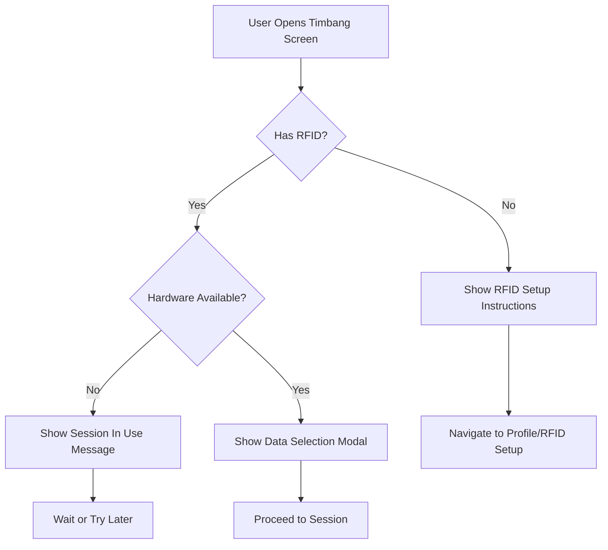
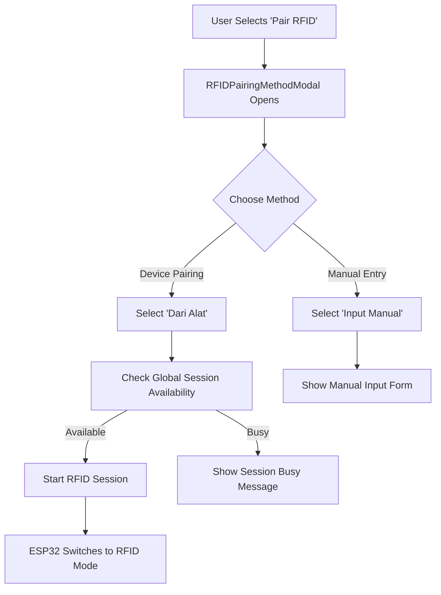

# Data Collection Flow & RFID Pairing - Child Nutrition Monitoring System

## Overview

This document describes the complete data collection workflow and RFID pairing process in the Intan child nutrition monitoring system, covering both measurement data collection and RFID card pairing from user interaction to data storage and analysis.

## System Architecture

```
┌─────────────────┐    ┌─────────────────┐    ┌─────────────────┐
│   Mobile App    │    │    Firebase     │    │   ESP32 IoT     │
│ Data Collection │◄──►│  Real-time Sync │◄──►│ Sensor Reading  │
│ RFID Pairing    │    │ Session Control │    │ RFID Detection  │
└─────────────────┘    └─────────────────┘    └─────────────────┘
         │                       │                       │
    ┌────▼────┐             ┌────▼────┐             ┌────▼────┐
    │ Profile │             │ Session │             │ Sensors │
    │ Forms   │             │ Coord   │             │ ML Algo │
    │ Modals  │             │ Storage │             │ Display │
    └─────────┘             └─────────┘             └─────────┘
```

# Part 1: Data Collection Flow

## 1. Data Types Collected

### User Profile Data
- **Child Information**
  - Name (string)
  - Birth date (Date) → Auto-calculates age in years/months
  - Gender (male/female)
  - RFID card assignment
- **Parent Information**
  - Parent name (string)
  - Email (for authentication)
- **Storage Location**: `/users/{userId}` collection
- **Auto-updates**: Age recalculated on each profile access

### Measurement Data
- **Physical Measurements**
  - Weight (kg) - from HX711 load cell sensor
  - Height (cm) - from HC-SR04 ultrasonic sensor
  - BMI (calculated) - weight / (height/100)²
- **Assessment Data**
  - Nutrition status (AI-determined using K-NN algorithm)
  - Eating pattern (user-selected: kurang/cukup/berlebih)
  - Child response level (user-selected: pasif/sedang/aktif)
- **Metadata**
  - Timestamp (measurement date/time)
  - User demographics (age, gender at time of measurement)
- **Storage Location**: `/users/{userId}/data/{measurementId}` subcollection

## 2. Complete Weighing Session Workflow

### Phase 1: Pre-Session Validation



**Key Validations:**
- RFID card must be paired with user account
- Hardware must not be in use by another user
- User authentication must be valid

### Phase 2: Data Selection & Session Creation

```javascript
// DataSelectionModal User Inputs
const selectionData = {
  eatingPattern: 'kurang' | 'cukup' | 'berlebih',
  childResponse: 'pasif' | 'sedang' | 'aktif'
};

// Session Creation in globalSessionService.js
await startWeighingSession(userId, selectionData);
```

**Process:**
1. User selects eating pattern and child response via DataSelectionModal
2. App calls `startWeighingSession()` with user parameters
3. Global session document created in Firebase with:
   - Session type: "weighing"
   - User data (ID, name, RFID, age, gender)
   - Selection data (eating pattern, child response)
   - Measurement placeholders (weight: 0, height: 0)

### Phase 3: Hardware Coordination & Measurement

```cpp
// ESP32 Firmware Flow (WiFi.ino)
processGlobalSession() {
  // 1. Monitor Firebase every 5 seconds
  // 2. Detect session type "weighing"
  // 3. Load user data and session parameters
  // 4. Wait for matching RFID tap
  // 5. Begin sensor measurements
  // 6. Run K-NN nutrition classification
  // 7. Upload results to Firebase
}
```

**Hardware Process:**
1. **Session Detection**: ESP32 monitors Firebase for active sessions
2. **RFID Validation**: Hardware waits for matching RFID card tap
3. **Sensor Reading**: 
   - Load cell measures weight (filtered and averaged)
   - Ultrasonic sensor measures height (distance from ceiling)
4. **ML Processing**: K-NN algorithm determines nutrition status
5. **Data Upload**: Two-phase upload to Firebase:
   - Phase 1: Measurement values
   - Phase 2: Completion flag

### Phase 4: Result Processing & Storage

```javascript
// App-side completion detection (timbang.jsx)
useEffect(() => {
  const unsubscribe = subscribeToSystemStatus((status) => {
    if (status.measurementComplete && status.weight > 0) {
      handleWeighingCompleted(status);
    }
  });
  return unsubscribe;
}, []);
```

**Completion Flow:**
1. **Real-time Detection**: App listens for `measurementComplete: true`
2. **Data Validation**: Checks weight > 0 and height > 0
3. **Storage Operations**:
   - `addMeasurement()`: Saves to user's data collection
   - `updateUserProfile()`: Updates latest weighing cache
4. **UI Update**: Shows WeighingResultModal with comprehensive results
5. **Session Cleanup**: `endGlobalSession()` resets all session fields

## 3. Firebase Data Structure

### Global Session Document (`systemStatus/hardware`)
```javascript
{
  // Session Control
  isInUse: boolean,
  sessionType: "weighing" | "rfid" | "",
  currentUserId: string,
  currentUserName: string,
  startTime: timestamp,
  lastActivity: timestamp,
  timeout: boolean,
  
  // User Session Data (for weighing)
  eatingPattern: "kurang" | "cukup" | "berlebih",
  childResponse: "pasif" | "sedang" | "aktif",
  userRfid: string,
  ageYears: number,
  ageMonths: number,
  gender: "male" | "female",
  
  // Measurement Results
  weight: number,        // kg
  height: number,        // cm
  imt: number,          // BMI
  nutritionStatus: string,
  measurementComplete: boolean,
  
  // RFID Session Data
  rfid: string          // For pairing sessions
}
```

### User Profile Structure (`users/{userId}`)
```javascript
{
  // Personal Information
  name: string,
  parentName: string,
  birthdate: Date,
  gender: "male" | "female",
  email: string,
  
  // Calculated Fields
  ageYears: number,      // Auto-calculated
  ageMonths: number,     // Auto-calculated
  
  // RFID Integration
  rfid: string,          // Hex identifier
  rfidNumber: string,    // Human-readable number
  
  // Latest Measurement Cache
  latestWeighing: {
    weight: number,
    height: number,
    imt: number,
    nutritionStatus: string,
    dateTime: Date
  }
}
```

### Measurement Record (`users/{userId}/data/{measurementId}`)
```javascript
{
  // Physical Measurements
  weight: number,           // From load cell
  height: number,           // From ultrasonic
  imt: number,             // Calculated BMI
  
  // Classification Results
  nutritionStatus: string,  // K-NN algorithm result
  
  // Session Context
  eatingPattern: string,    // User selection
  childResponse: string,    // User selection
  
  // User Context (at time of measurement)
  ageYears: number,
  ageMonths: number,
  gender: string,
  
  // Timestamps
  dateTime: Date,           // Measurement time
  createdAt: Date          // Record creation
}
```

## 4. Data Flow Services

### globalSessionService.js
**Purpose**: Manages shared ESP32 hardware access

**Key Functions:**
```javascript
// Session Management
initializeSystemStatus()     // Initialize Firebase document
startWeighingSession(userId, data)  // Create weighing session
startRfidSession(userId)     // Create RFID pairing session
endGlobalSession()          // Cleanup session

// Monitoring
subscribeToSystemStatus(callback)   // Real-time status updates
isSessionAvailable()        // Check hardware availability
isMySession(userId)         // Validate session ownership
```

### dataService.js
**Purpose**: CRUD operations for measurement data

**Key Functions:**
```javascript
// Data Operations
addMeasurement(userId, data)        // Store new measurement
getUserMeasurements(userId)         // Retrieve user history
updateMeasurement(userId, id, data) // Edit measurement
deleteMeasurement(userId, id)       // Remove measurement

// Utilities
generateRandomData(count)           // Testing data generation
```

### userService.js
**Purpose**: User profile management with auto-calculations

**Key Functions:**
```javascript
// Profile Management
createUserProfile(userData)         // Account creation
updateUserProfile(userId, data)     // Profile updates with age calc
getUserProfile(userId)              // Retrieve profile

// RFID Management
checkRfidNumberExists(number)       // Uniqueness validation
removeUserRFID(userId)              // Remove RFID assignment
```

## 5. Machine Learning Integration

### K-NN Nutrition Classification

**Input Features:**
- Weight (kg)
- Height (cm)
- Age (years and months)
- Gender (male/female)
- Eating pattern (kurang/cukup/berlebih)
- Child response (pasif/sedang/aktif)

**Output Categories:**
1. **Gizi Buruk** (Severe Malnutrition)
2. **Gizi Kurang** (Underweight)
3. **Gizi Baik** (Normal)
4. **Gizi Lebih** (Overweight)
5. **Obesitas** (Obese)

**Implementation:**
- Algorithm runs on ESP32 firmware
- Real-time classification during measurement
- Results stored with measurement data
- Used for health recommendations

# Part 2: RFID Pairing Flow

## 6. RFID System Overview

### RFID Technology Used
- **Hardware**: MFRC522 RFID reader module
- **Frequency**: 13.56 MHz (ISO14443A)
- **Card Type**: Compatible with MIFARE Classic cards
- **Read Range**: 3-5 cm proximity
- **ESP32 Pins**: GPIO 5 (SDA), GPIO 27 (RST)

### Data Storage Structure
Each user profile stores two RFID-related fields:
```javascript
{
  rfid: "A1B2C3D4",        // Hex identifier from card
  rfidNumber: "001"        // Human-readable number for identification
}
```

## 7. RFID Pairing Methods

### Method 1: Device-Based Pairing (Recommended)
**Flow**: App → ESP32 → RFID Detection → App → Number Assignment

### Method 2: Manual Pairing
**Flow**: App → Manual Input → Validation → Storage

## 8. Complete Device-Based Pairing Workflow

### Phase 1: Pairing Initiation



**UI Components Involved:**
- **RFIDPairingMethodModal**: Method selection interface
- **RFIDNumberModal**: Number input after device detection
- **Manual input forms**: Direct RFID entry

### Phase 2: Global Session Creation

```javascript
// globalSessionService.js - startRfidSession()
const sessionData = {
  isInUse: true,
  sessionType: 'rfid',
  currentUserId: userId,
  currentUserName: userName,
  startTime: new Date(),
  lastActivity: new Date(),
  rfid: '',  // Will be populated by ESP32
  timeout: false
};
```

**Session Control:**
1. **Availability Check**: Ensures hardware not in use
2. **Session Lock**: Sets `isInUse: true` to prevent conflicts
3. **User Assignment**: Records session owner
4. **Type Setting**: Sets `sessionType: 'rfid'`
5. **Timeout Setup**: 5-minute session timeout

### Phase 3: ESP32 RFID Detection

```cpp
// IntanFirmwareR1.ino - Main loop integration
void loop() {
  updateSensorData();      // Includes RFID scanning
  processGlobalSession();  // Handles session state
  displayCurrentScreen();  // Shows RFID pairing UI
}

// WiFi.ino - processSessionData()
if (currentSession.sessionType == "rfid") {
  handleRFIDPairingSession();
}
```

**Hardware Process:**
1. **Session Detection**: ESP32 monitors Firebase every 5 seconds
2. **Mode Switch**: Changes display to "RFID Pairing Mode"
3. **Card Scanning**: Continuous RFID card detection
4. **Data Extraction**: Reads card UID and converts to hex string
5. **Firebase Update**: Uploads RFID code to global session document
6. **State Reset**: Returns to idle mode after successful detection

### Phase 4: RFID Code Processing

```javascript
// App-side RFID detection processing
useEffect(() => {
  const unsubscribe = subscribeToSystemStatus((status) => {
    if (status.sessionType === 'rfid' && status.rfid && isMySession(status)) {
      setDetectedRfid(status.rfid);
      setShowNumberModal(true);
      endGlobalSession(); // Cleanup session immediately
    }
  });
  return unsubscribe;
}, []);
```

**App-Side Processing:**
1. **Real-time Monitoring**: App listens for RFID field updates
2. **Ownership Validation**: Confirms session belongs to current user
3. **Code Extraction**: Retrieves hex RFID identifier
4. **Number Input**: Shows modal for user to assign readable number
5. **Session Cleanup**: Immediately ends global session

### Phase 5: Number Assignment & Validation

```javascript
// RFIDNumberModal.jsx workflow
const handleSaveRfid = async () => {
  // Validate input
  if (!rfidNumber || isNaN(rfidNumber)) {
    Alert.alert('Error', 'Please enter a valid number');
    return;
  }
  
  // Check uniqueness
  const existingUsers = await checkRfidNumberExists(rfidNumber);
  if (existingUsers.length > 0) {
    Alert.alert('Number Already Used', 
      `Number ${rfidNumber} is already used by ${existingUsers[0].name}`);
    return;
  }
  
  // Save to user profile
  await updateUserProfile(userId, {
    rfid: detectedRfid,
    rfidNumber: rfidNumber
  });
};
```

**Validation Process:**
1. **Input Validation**: Ensures number is numeric and not empty
2. **Uniqueness Check**: Queries all users for duplicate RFID numbers
3. **Conflict Resolution**: Shows clear error messages for duplicates
4. **Profile Update**: Saves both hex code and readable number
5. **Age Preservation**: Update preserves existing age calculations

## 9. Manual Pairing Workflow

### Manual Input Interface
```javascript
// Manual pairing form fields
const manualInputData = {
  rfidCode: '',      // Hex identifier (manual entry)
  rfidNumber: ''     // Human-readable number
};
```

**Manual Process:**
1. **Form Display**: Shows input fields for both RFID code and number
2. **Input Validation**: Validates hex format and numeric number
3. **Uniqueness Check**: Validates both code and number uniqueness
4. **Direct Save**: Updates user profile without global session
5. **Immediate Feedback**: Shows success/error messages

### Validation Rules
- **RFID Code**: Must be valid hexadecimal string
- **RFID Number**: Must be numeric and unique across all users
- **Both Fields Required**: Cannot save partial RFID data
- **Admin Override**: Admins can reassign RFID cards

## 10. Hardware Integration Details

### ESP32 RFID Reader Setup
```cpp
// IntanFirmwareR1.ino - Sensor initialization
void initializeSensorModules() {
  sensorManager.addModule("rfid", new RFID_Mfrc522(5, 27));
}

// rfid-sens.cpp - RFID detection logic
bool RFID_Mfrc522::update(JsonDocument* doc) {
  if (MFRC522::PICC_IsNewCardPresent() && MFRC522::PICC_ReadCardSerial()) {
    String uuid = "";
    for (byte i = 0; i < MFRC522::uid.size; i++) {
      uuid += String(MFRC522::uid.uidByte[i], HEX);
    }
    (*doc)[name] = uuid;
    return true;
  }
  return false;
}
```

### Session State Management
```cpp
// Menu.ino - RFID pairing display
void displayRFIDPairingScreen() {
  display.clearDisplay();
  display.setCursor(0, 0);
  display.println("RFID Pairing Mode");
  display.println("Tap your card...");
  
  if (!currentRfidTag.isEmpty()) {
    display.println("Card detected!");
    display.println(currentRfidTag);
    updateGlobalSessionRFID(currentRfidTag);
    currentRfidTag = "";
    backToIdleState();
  }
  
  display.display();
}
```

## 11. Global Session Coordination

### Multi-user Coordination
- **Exclusive Access**: Only one user can access hardware at a time
- **Real-time Updates**: All users see current session state
- **Session Types**: Separate handling for weighing vs RFID sessions
- **Timeout Management**: 10 minutes for weighing, 5 minutes for RFID
- **Conflict Prevention**: Clear messaging when hardware is busy
- **Graceful Cleanup**: Automatic session reset after completion

### Session States & Timeouts
```javascript
// Global States (utils/globalStates.js)
GLOBAL_SESSION_TYPES = { WEIGHING: 'weighing', RFID: 'rfid' }
SESSION_TIMEOUTS = { RFID: 5 * 60 * 1000, WEIGHING: 10 * 60 * 1000 }

// Weighing States (utils/weighingStates.js)  
WEIGHING_STATES = { IDLE: 0, WAITING: 1, MEASURING: 2, COMPLETED: 3, ERROR: 4 }
```

## 12. Data Validation & Security

### RFID Uniqueness Validation
```javascript
// userService.js - checkRfidNumberExists()
export const checkRfidNumberExists = async (rfidNumber) => {
  const usersRef = collection(db, 'users');
  const q = query(usersRef, where('rfidNumber', '==', rfidNumber));
  const querySnapshot = await getDocs(q);
  
  return querySnapshot.docs.map(doc => ({
    id: doc.id,
    ...doc.data()
  }));
};
```

### Security Measures
- **User Authentication**: Only authenticated users can pair RFID
- **Session Ownership**: Users can only modify their own RFID
- **Admin Override**: Admins can manage any user's RFID
- **Audit Trail**: Firebase tracks all RFID assignment changes
- **Duplicate Prevention**: System prevents RFID number conflicts

### Data Integrity
- **Atomic Updates**: RFID code and number updated together
- **Rollback Support**: Failed updates don't corrupt user profile
- **Age Preservation**: RFID updates preserve calculated age fields
- **Profile Consistency**: Validates complete user profile after updates

## 13. Error Handling & Recovery

### Common Error Scenarios

1. **Hardware Not Available**
   ```javascript
   if (!isSessionAvailable()) {
     Alert.alert('Hardware Busy', 
       'The device is currently being used by another user. Please try again later.');
   }
   ```

2. **Duplicate RFID Number**
   ```javascript
   if (existingUsers.length > 0) {
     Alert.alert('Number Already Used', 
       `Number ${rfidNumber} is already used by ${existingUsers[0].name}`);
   }
   ```

3. **Session Timeout**
   ```javascript
   if (sessionExpired) {
     Alert.alert('Session Expired', 
       'The session has expired. Please try again.');
     endGlobalSession();
   }
   ```

4. **Network Errors**
   ```javascript
   try {
     await updateUserProfile(userId, data);
   } catch (error) {
     Alert.alert('Network Error', 
       'Failed to save data. Please check your connection and try again.');
   }
   ```

### Recovery Mechanisms
- **Manual Cleanup**: Cancel button calls `endGlobalSession()`
- **Automatic Refresh**: Pull-to-refresh reloads session status
- **Network Recovery**: Firebase handles reconnection automatically
- **Hardware Recovery**: ESP32 can reset measurement data on errors
- **Session Validation**: Each operation validates session ownership

## 14. Real-time Synchronization

### Firebase Listeners Pattern
```javascript
// Real-time data flow
const unsubscribe = onSnapshot(docRef, (doc) => {
  const data = doc.data();
  updateUIState(data);
});

// Cleanup on component unmount
return () => unsubscribe();
```

**Synchronization Points:**
- **Global Session Status**: Live hardware coordination
- **Measurement Completion**: Instant result notification
- **RFID Detection**: Real-time pairing feedback
- **User Data Updates**: Profile changes across devices

## 15. Performance Optimizations

### Data Caching
- **Latest Weighing**: Cached in user profile for quick access
- **Profile Data**: Locally cached for offline access
- **Session Status**: Real-time caching for responsive UI

### Efficient Queries
- **User-specific Collections**: Partitioned measurement data
- **Indexed Queries**: Optimized for date-based filtering
- **Minimal Data Transfer**: Only necessary fields in real-time updates

### Hardware Efficiency
- **Sensor Averaging**: Multiple readings averaged for accuracy
- **Power Management**: Efficient sensor polling cycles
- **Data Compression**: Minimal Firebase document updates

## 16. Administrative Features

### Admin Capabilities
- **User Management**: View and manage all users
- **RFID Assignment**: Reassign RFID cards between users
- **System Monitoring**: Hardware status and session coordination
- **Data Overview**: System-wide statistics and analytics
- **Conflict Resolution**: Resolve RFID and session conflicts

### Security & Compliance
- **Data Protection**: User data partitioned by user ID
- **Privacy Controls**: Users can delete their own data
- **Audit Logging**: Firebase tracks all system changes
- **Role-based Access**: Admin vs user permissions

## 17. Future Enhancements

### Planned Improvements
- **Session Timeout Enforcement**: Automatic cleanup after timeout
- **Batch Data Export**: CSV/Excel export capabilities
- **Advanced Analytics**: Trend analysis and growth charts
- **Offline Support**: Local data caching and sync
- **Multi-language**: Internationalization support
- **Multiple Devices**: Support for multiple ESP32 units
- **NFC Support**: Add Near Field Communication capability
- **QR Code Alternative**: QR code backup for RFID functionality

### Integration Possibilities
- **Student ID Systems**: Integration with school ID cards
- **Health Records**: Integration with electronic health record systems
- **Parent Access**: Parent mobile app with child management
- **Analytics Dashboard**: Real-time monitoring and insights

---

This comprehensive documentation covers both the data collection workflow and RFID pairing process in the Intan child nutrition monitoring system. The architecture demonstrates sophisticated integration between mobile app, cloud database, and IoT hardware for automated health data collection and user identification management.